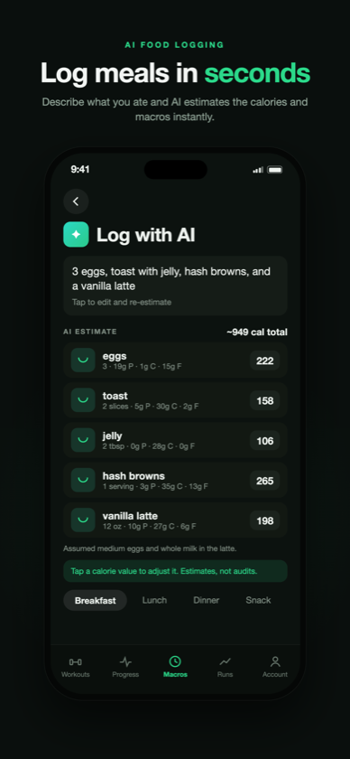
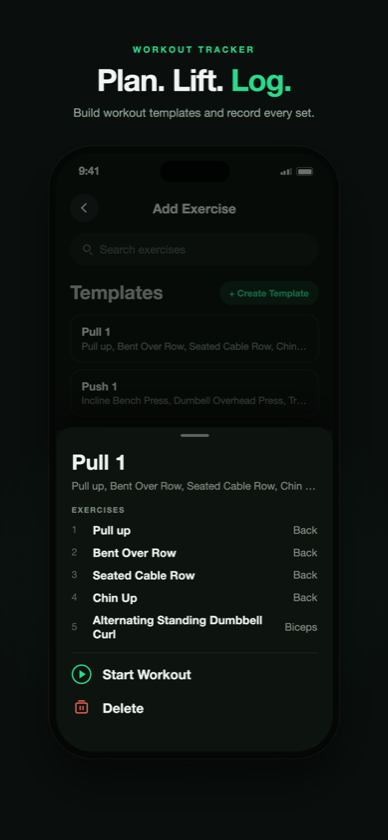
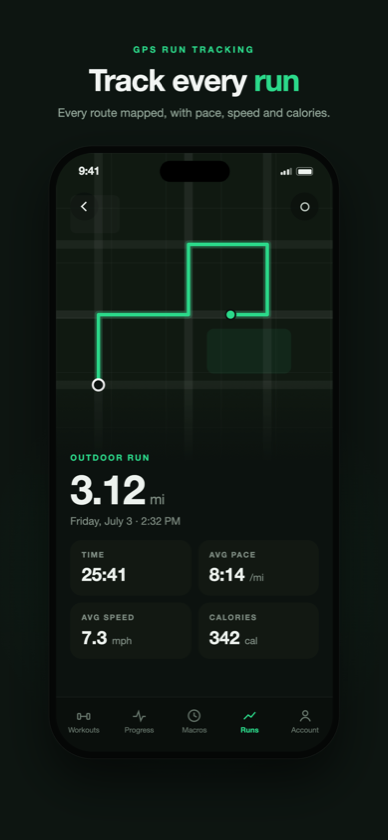
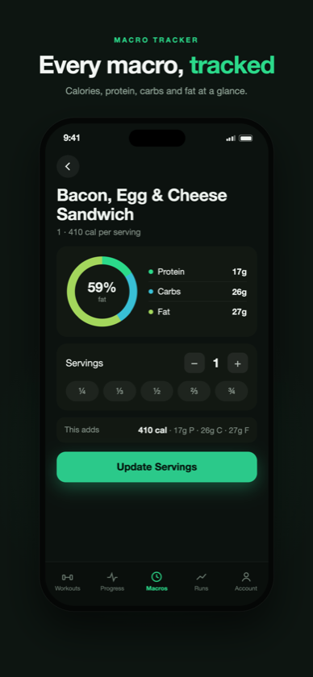
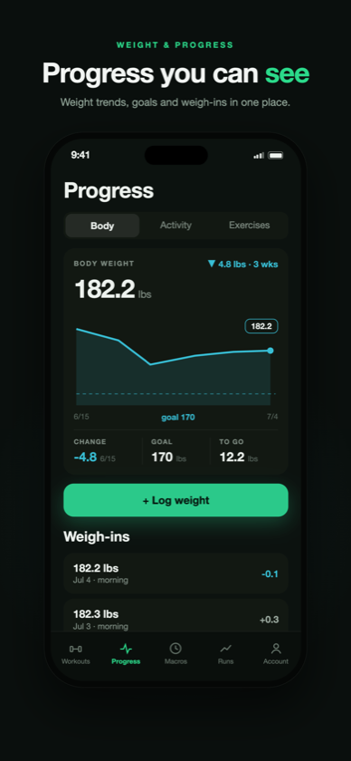
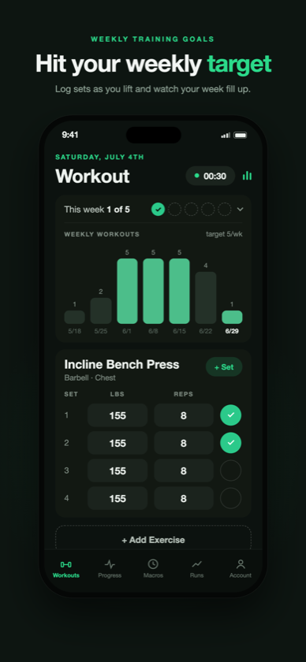

<div align="center">


# State of Health

**Lift. Eat. Run. One app keeps score.**

[**Download on the App Store**](https://apps.apple.com/us/app/state-of-health/id6470658244?platform=iphone) · [**thestateofhealth.com**](https://thestateofhealth.com/)


</div>

---

Your training and your diet are the same goal, so why are they in separate apps? State of Health puts your workouts, macros, and runs in one place, with none of the bloat that makes most fitness apps a chore to open.

<div align="center">
<table>
  <tr>
    <td></td>
    <td></td>
    <td></td>
  </tr>
  <tr>
    <td></td>
    <td></td>
    <td></td>
  </tr>
</table>
</div>

## What it does

**Workouts.** Build templates, start a session, and log sets as you lift. Progressive overload tracking watches every exercise and tells you when it's time to add weight or reps. Set a weekly target and watch the week fill up.

**Macros.** Type "3 eggs, toast with jelly, hash browns" and the AI breaks it into foods with calories and macros you can tweak. Prefer doing it by hand? Search the USDA database, which covers nearly every labeled food in the US, or build your own custom foods.

**Runs.** GPS tracking with your route on the map, pace, speed, and calorie burn. Runs feed into the same daily activity picture as your lifts and steps.

**Progress.** Body weight trends against your goal, strength charts for every exercise, and a full history of everything you've logged. Every day you train or eat, the app keeps the diary for you.

## Under the hood

- React Native 0.86 on the New Architecture, Expo SDK 57
- TypeScript end to end
- TanStack Query for server state, Zustand for client state
- Node + Postgres backend with Prisma
- Firebase for auth (email, Google Sign-In) and Remote Config

## Development

```bash
npm install
npx expo run:ios
```

## Shipping a release

1. Bump `version` and `buildNumber` in `app.json`
2. Build and submit:

```bash
eas build --platform ios --profile production --auto-submit
```

Or build and submit separately with `eas build --platform ios --profile production` and `eas submit -p ios --latest`.

---

<div align="center">

Built by <a href="https://github.com/Kennygunderman">Kenny Gunderman</a>

</div>
